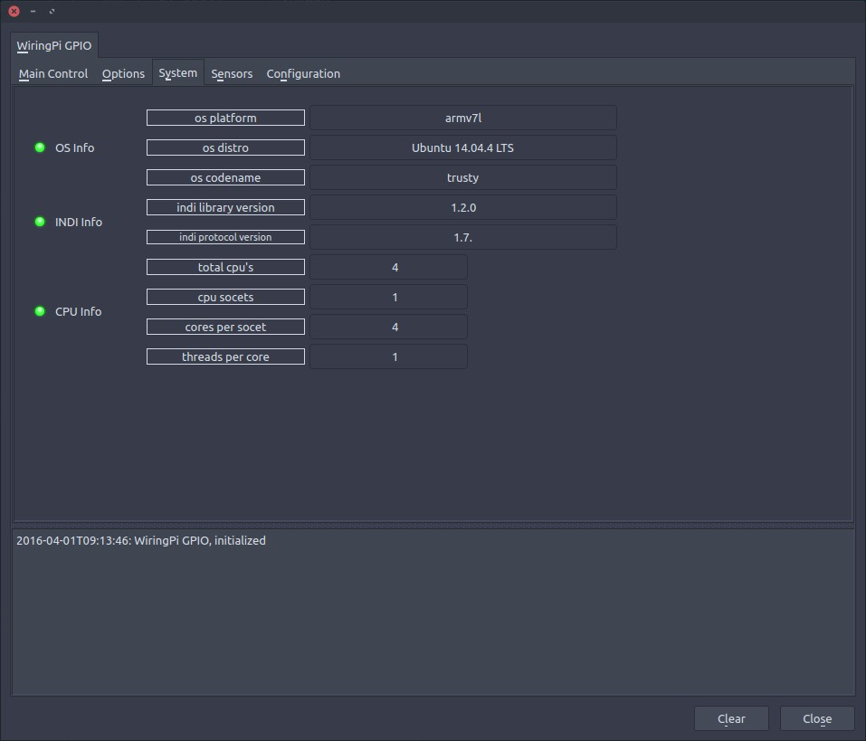
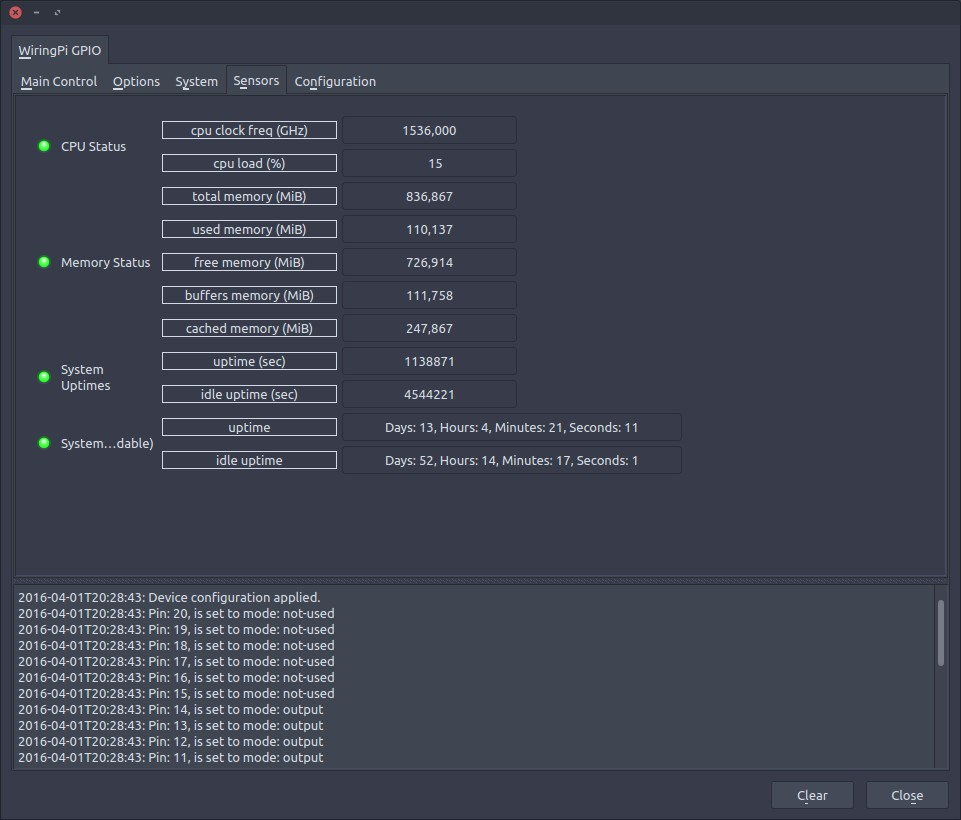
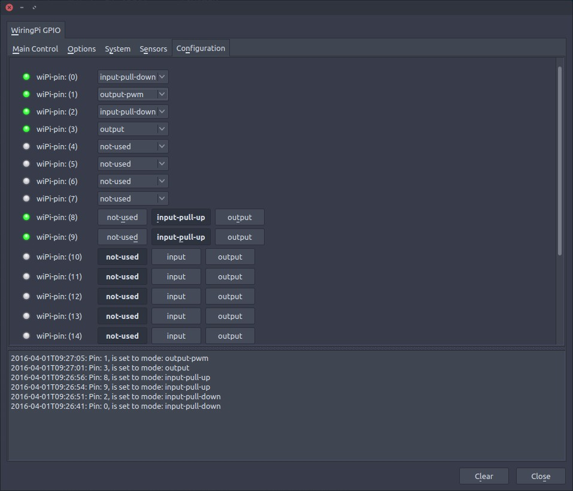

### INDI WiringPi GPIO

#### Summary
INDI WiringPi GPIO is a General Purpose Input Output driver compatible with INDI Control Panel and INDI clients. (Tested only with EKOS in KStars)
The project has been compiled and tested on Linux (Raspian Jessie) ARM (Raspberry Pi 1 model B), and (Lubuntu Trusty) armv7l (Odroid C1+).
The "driver" uses the WiringPi library to enable GPIO controll from INDI clients, including Input - pull(up/down/off), Output (digital/pwm), and enabling GPIO-clock.

To use the /dev/gpiomem interface and run without sudo, you must set environment variable WIRINGPI_GPIOMEM before starting the driver, and add your user to the "gpio" group.
In this mode "output-pwm and gpio-clock" calls will be ignored, and have no effect.
To use the new /dev/gpiomem interface you need to be running a 4.1.7 or greater kernel!
```
$ export WIRINGPI_GPIOMEM=1
$ indiserver indi_wiringpi_gpio
```

For pin functions of the Raspberry Pi, see [wiringpi.com - special pin functions](http://wiringpi.com/pins/special-pin-functions/)


Follow the link for pin layout for [Odroid C1](http://www.hardkernel.com/main/products/prdt_info.php?g_code=G141578608433&tab_idx=2), or [Odroid C1+](http://www.hardkernel.com/main/products/prdt_info.php?g_code=G143703355573&tab_idx=2)

<br>
#### Known issues
* THIS IS A WORK IN PROGRESS, not a finished product...
* In the current state the WiringPi wiringPiSetup (void); function is used to initiate the library. This is so no special handeling is necessary to support all the variants of Raspberry Pi, and Odroid that has a ported version of WiringPi. However, this means that the indiserver must be started with sudo: $ sudo indiserver indi_wiringpi_gpio to enable pwm-output, and gpio-clock
* On devices where not all pins are supported, there will be a crash when configuring a unsupported pin. On the Odroid C1+ only pin 0-7 and 10-14 is supported, and pwm-output pin 1 is not supported. use the [~/Projects/wiringPi/gpio/pintest](http://wiringpi.com/the-gpio-utility/pin-test/) to check supported pins on your board.
* When using the wiringPiSetup (void); function to initiate WiringPi, all errors are considered a "fatal" error. This means that starting indi_wiringpi_gpio on a system without supported gpio board, the driver will crash.
* On the System tab, only Ubunut distros wil show "os-distro, and os-codename"

<br>
#### Attributions
* This project could not be done without the existing libindi project or the WiringPi library, among others.
* This project is 3rd party and dependent on the mentioned projects, and licensed accordingly. See LICENSE and COPYING.BSD.
* This driver is loosely based on the [RaspberryPi GPIO Driver](http://indilib.org/develop/indiforjava/i4jdrivers/raspberry-pi-gpio-driver.html) buildt for "INDI for Java", and ames to serve the same function for INDI
* Some files have additional lisence information, see file headers.

<br>
#### Installing dependencies
##### libindi [INDILib], and it's dependencies
* To build libindi from source [see instructions](http://www.indilib.org/forum/general/210-howto-building-latest-libindi-ekos.html)

##### libwiringPi.so [WiringPi], and it's dependencies
```
$ mkdir ~/Projects
$ cd ~/Projects
$ git clone git://git.drogon.net/wiringPi           # for Raspberry PI
$ cd wiringPi                                       # -------||-------
$ git clone https://github.com/hardkernel/wiringPi  # for Odroid
$ cd hardkernel/wiringPi                            # ----||----
$ ./build
$ echo "/usr/local/lib" | sudo tee /etc/ld.so.conf.d/usr_local_lib.conf
$ sudo ldconfig
```

##### gawk is being used for averaging cpu load
```
$ sudo apt-get install gawk
```

<br>
#### Install INDI WiringPi GPIO
```
$ cd ~/Projects
$ git clone https://github.com/magnue/indi_wiringpi_gpio.git
$ cd indi_wiringpi_gpio
$ mkdir build
$ cd build
$ cmake -DCMAKE_INSTALL_PREFIX=/usr . ..
$ sudo make install
```
##### Update
```
$ cd ~/Projects/indi_wiringpi_gpio/
$ git pull
$ cd build
$ sudo make install
```

<br>
#### Screenshots

##### System
* System



##### Sensors
* Sensors



##### Config
* Config
* read known issues before setting this..



##### Main Control
* Main control


